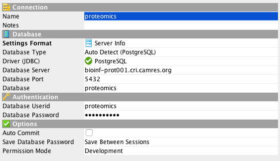

# Proteomics database project

This project is to create a database in order to load proteome datasets and ease the query of these datasets.


## Install (python) dependencies in a virtual environment

Python 2.7 and git must be installed.

Postgres needs to be installed too, if you wish to create your own database.

#### On Unix-like systems
* On Mac install Postgres using http://postgresapp.com/ for OSX which is straight forward and standard Mac app and add /Applications/Postgres.app/Contents/Versions/X.X/bin/ to your path

* On Centos6

```
sudo yum install python-devel postgresql-devel
```

#### On windows

* Download Python 2.7 from https://www.python.org/downloads/ and install it

* Test if python is working, open the `Command Prompt` (`cmd`) and type these commands:
```
C:\Python27\python.exe
>>> quit()
```

### Clone this GitHub project

```
git clone https://github.com/crukci-bioinformatics/proteomics.git
cd proteomics
```

#### or clone it using GitHub Desktop

https://desktop.github.com/

using this url for the project `https://github.com/crukci-bioinformatics/proteomics.git` or directly by clicking on `Open in Desktop` from the web https://github.com/crukci-bioinformatics/proteomics.


### Install python libraries

#### On Unix-like systems
```
virtualenv venv
source venv/bin/activate
pip install -r requirements.txt
```

#### On windows

Open the `Command Prompt` (`cmd`) and type these commands:
```
cd Documents\GitHub\proteomics\

C:\Python27\Scripts\pip.exe install virtualenv
C:\Python27\Scripts\virtualenv.exe venv

venv\Scripts\activate.bat
pip install -r requirements.txt
```

## Create the database (only once)

If the database already exists, all tables will be dropped.

```
python create_db.py
```

## Load data

### Activate your virtual environment

#### On Unix-like systems
```
cd directory_of_this_project
source venv/bin/activate
```

#### On Windows

Open the `Command Prompt` (`cmd`) and type these commands:
```
cd Documents\GitHub\proteomics\
venv\Scripts\activate.bat
```

### Loading data


```bash
python load_data.py --file=data/PRxxx.xlsx --id=PRxxx
```

On windows:
```
python load_data.py --file=T:\group_folders\Clive_folder\PRxxx.xlsx --id=PRxxx
```

Update data to existing project
```bash
python load_data.py --file=data/PRxxx.xlsx --id=PRxxx --clean
```

Delete all data associated to existing project
```bash
python load_data.py --id=PRxxx --clean
```

#### Loading v1.4 data

```bash
python load_data.py --file=data/PR526.xlsx --id=PR526 --verison=v14
```

### Updating project details

```
python update_projects.py --file=update_projects.xlsx
```

NB. make sure the header of the excel file is
```
id	proteomics_id	completion_date	description	experiment_type	researcher	research_group	cell_or_tissue_type	species	instrument	experimental_details
```
without any empty rows and columns.

See [Excel template file](update_projects.xlsx)

## Query data

### Accessing the proteomics database

- Using DBVisualizer http://www.dbvis.com/
  - Database Server: `bioinf-prot001.cri.camres.org`
  - Database: `proteomics`
  - Database Userid: `proteomics`
    - **Read only access**: instead of using the `proteomics` user who has read/write access onto the proteomics database, a `readonly` account is available for querying.

  

- Using the terminal, with pgsql installed:
  ```
  $ psql -h bioinf-prot001.cri.camres.org -p 5432 -U proteomics -d proteomics
  psql (9.3.7, server 9.5.4)
  WARNING: psql major version 9.3, server major version 9.5.
           Some psql features might not work.
  Type "help" for help.

  proteomics=> \q
  ```

### Data model

Three tables' database diagram: Project, Protein & Peptide


### Using SQL queries

* get all projects in DB
```
select * from project
```

* get all proteins within a project
```
select *
from project, protein
where protein.project_id = project.id
and project.proteomics_id = 'PR526'
```

* get all peptides with a certain sequence
```
select *
from project, protein, peptide
where protein.project_id = project.id
and peptide.protein_id = protein.id
and peptide.sequence = 'DLYANTVLSGGTTMYPGIADR'
```

* get all proteins with a certain accession and all associated peptides
```
select *
from project, protein, peptide
where protein.project_id = project.id
and peptide.protein_id = protein.id
and protein.accession = 'P63261'
```

* count the number of peptides per project given a certain protein accession
```
select project.proteomics_id, project.completion_date, project.experiment_type, project.instrument, project.cell_or_tissue_type, count(peptide.id)
from project, protein, peptide
where protein.project_id = project.id
and peptide.protein_id = protein.id
and protein.accession = 'P63261'
group by project.proteomics_id, project.completion_date, project.experiment_type, project.instrument, project.cell_or_tissue_type
order by project.completion_date
```

* count the number of peptides per project given a peptide sequence
```
select project.proteomics_id, project.completion_date, project.experiment_type, project.instrument, project.cell_or_tissue_type, count(peptide.id)
from project, protein, peptide
where protein.project_id = project.id
and peptide.protein_id = protein.id
and peptide.sequence = 'DLYANTVLSGGTTMYPGIADR'
group by project.proteomics_id, project.completion_date, project.experiment_type, project.instrument, project.cell_or_tissue_type
order by project.completion_date
```
