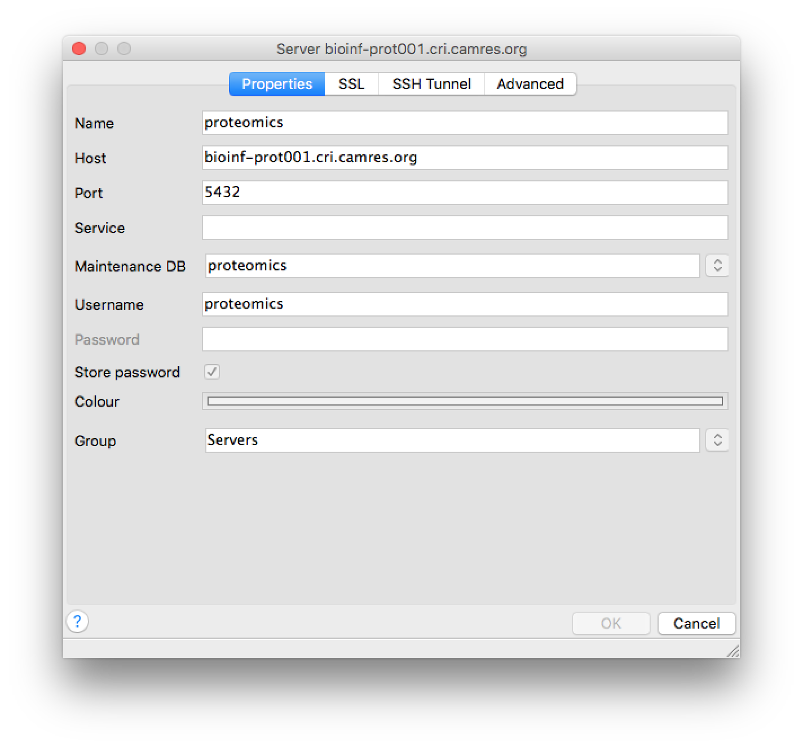
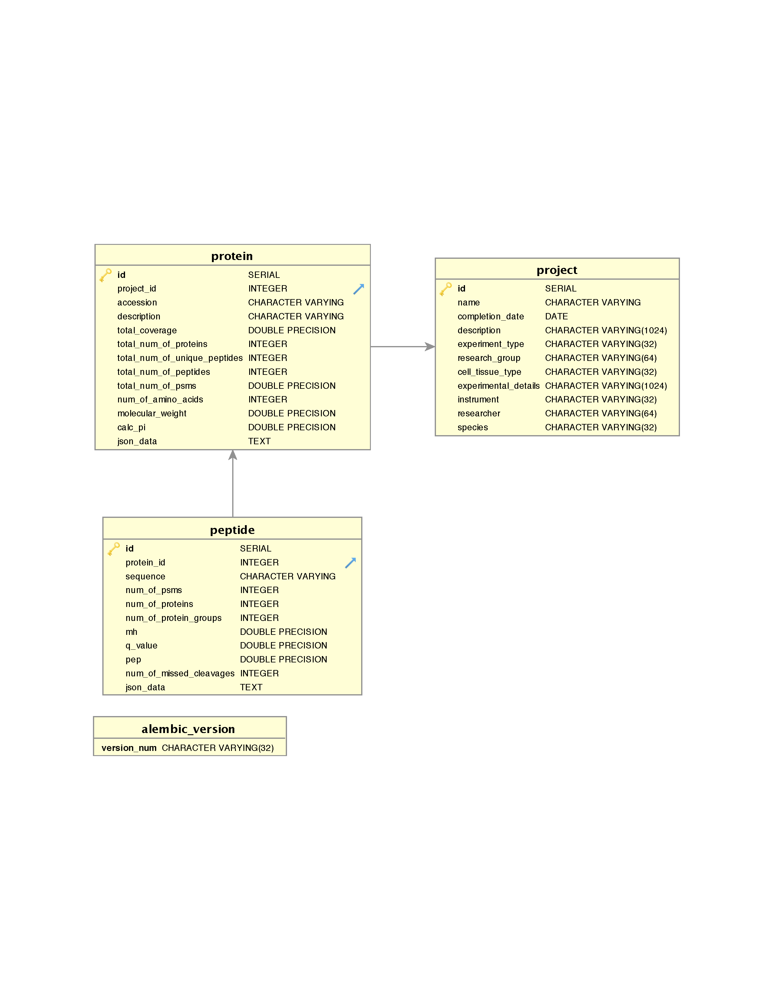

# Proteomics database project

This project is to create a database in order to load proteome datasets and ease the query of these datasets.


## Install (python) dependencies in a virtual environment

Python 2.7 and git must be installed.

Postgres needs to be installed too, if you wish to create your own database.

* On Mac install Postgres using http://postgresapp.com/ for OSX which is straight forward and standard Mac app and add /Applications/Postgres.app/Contents/Versions/X.X/bin/ to your path

* On Centos6

```
sudo yum install python-devel postgresql-devel
```

#### On windows

Download Python 2.7 from https://www.python.org/downloads/release/python-2713/
Open the windows `Command Prompt` and type these commands:

Testing python is installed:
```
C:\Python27\python.exe
>>> quit()
```

### Clone GitHub project

```
git clone https://github.com/crukci-bioinformatics/proteomics.git
cd proteomics
```

#### or clone it using GitHub Desktop

https://desktop.github.com/

using this url for the project `https://github.com/crukci-bioinformatics/proteomics.git` or directly by clicking on `Open in Desktop` from the web https://github.com/crukci-bioinformatics/proteomics.

#### or download its zip file

Download zip file in `C:\Files\` folder on github from https://github.com/crukci-bioinformatics/proteomics/archive/master.zip and unzip it


### Install python libraries

```
virtualenv venv
source venv/bin/activate
pip install -r requirements.txt
```

#### On windows

Open the `Command Prompt` and type these commands:
```
cd "My Documents"\GitHub\proteomics\

C:\Python27\Scripts\pip.exe install virtualenv
C:\Python27\Scripts\virtualenv.exe venv

venv\Scripts\activate.bat
pip install -r requirements.txt
```

## Create the database (only once)

If the database already exists, all tables will be dropped.

```
python create_db.py
```

## Load data

### Activate your virtual environment

```
cd directory_of_this_project
source venv/bin/activate
```

#### On windows

Open the `Command Prompt` and type these commands:
```
cd "My Documents"\GitHub\proteomics\
venv\Scripts\activate.bat
```

### Loading data

```bash
python load_data.py --file=data/PRxxx.xlsx --id=PRxxx
```
or
```
python load_data.py --file=T:\group_folders\Clive_folder\PRxxx.xlsx --id=PRxxx
```

Update data to existing project
```bash
python load_data.py --file=data/PRxxx.xlsx --id=PRxxx --clean
```

Delete all data associated to existing project
```bash
python load_data.py --id=PRxxx --clean
```

#### Loading v1.4 data

```bash
python load_data.py --file=data/PR526.xlsx --id=PR526 --verison=v14
```

### Updating project details

```
python update_projects.py --file=update_projects.xlsx
```

NB. make sure the header of the excel file is
```
id	proteomics_id	completion_date	description	experiment_type	researcher	research_group	cell_or_tissue_type	species	instrument	experimental_details
```
without any empty rows and columns.

See [Excel template file](update_projects.xlsx)

## Query data

### Accessing the proteomics database

- Using the terminal, with pgsql installed:

```
$ psql -h bioinf-prot001.cri.camres.org -p 5432 -U proteomics -d proteomics
psql (9.3.7, server 9.5.4)
WARNING: psql major version 9.3, server major version 9.5.
         Some psql features might not work.
Type "help" for help.

proteomics=> \q
```

-  Using pgadmin http://www.pgadmin.org/



- Using DBVisualizer http://www.dbvis.com/

#### Read only access

Instead of using the `proteomics` user who has read/write access onto the proteomics database, a `readonly` account is available for querying.

### Data model

Three tables' database diagram: Project, Protein & Peptide


### Using SQL queries

* get all projects in DB
```
select * from project;
```
* get all proteins within a project
```
select *
from project, protein
where protein.project_id = project.id
and project.proteomics_id = 'PR526';
```
* get all peptides with a certain sequence
```
select *
from project, protein, peptide
where protein.project_id = project.id
and peptide.protein_id = protein.id
and peptide.sequence = 'DLYANTVLSGGTTMYPGIADR';
```
* get all proteins with a certain accession and all associated peptides
```
select *
from project, protein, peptide
where protein.project_id = project.id
and peptide.protein_id = protein.id
and protein.accession = 'P63261'
```

### Using python

```
python query_data.py
```

### Using Galaxy

See [README](galaxy_proteomics/README.md)
